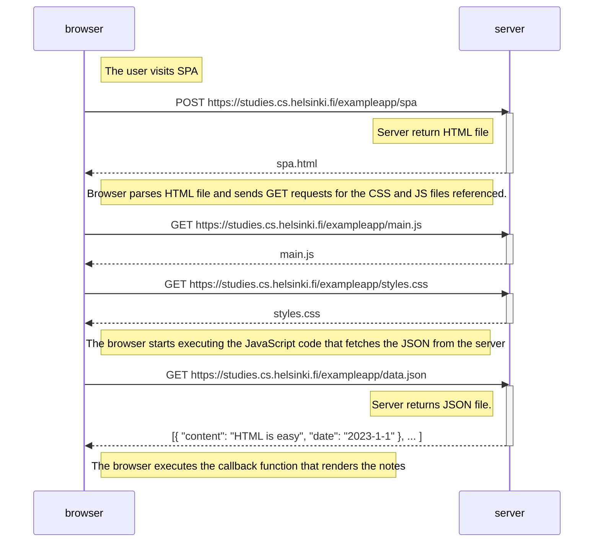

```mermaid
  sequenceDiagram
    participant browser
    participant server
    
    Note right of browser: The user visits SPA
   

    browser->>server: POST https://studies.cs.helsinki.fi/exampleapp/spa
    activate server

    Note left of server: Server return HTML file

    server-->>browser: spa.html
    deactivate server

    Note right of browser: Browser parses HTML file and sends GET requests for the CSS and JS files referenced.


    browser->>server: GET https://studies.cs.helsinki.fi/exampleapp/main.js
    activate server
    server-->>browser: main.js
    deactivate server
    browser->>server: GET https://studies.cs.helsinki.fi/exampleapp/styles.css
    activate server
    server-->>browser: styles.css
    deactivate server

    Note right of browser: The browser starts executing the JavaScript code that fetches the JSON from the server

    browser->>server: GET https://studies.cs.helsinki.fi/exampleapp/data.json
    activate server

    Note left of server: Server returns JSON file.

    server-->>browser: [{ "content": "HTML is easy", "date": "2023-1-1" }, ... ]
    deactivate server

    Note right of browser: The browser executes the callback function that renders the notes
```