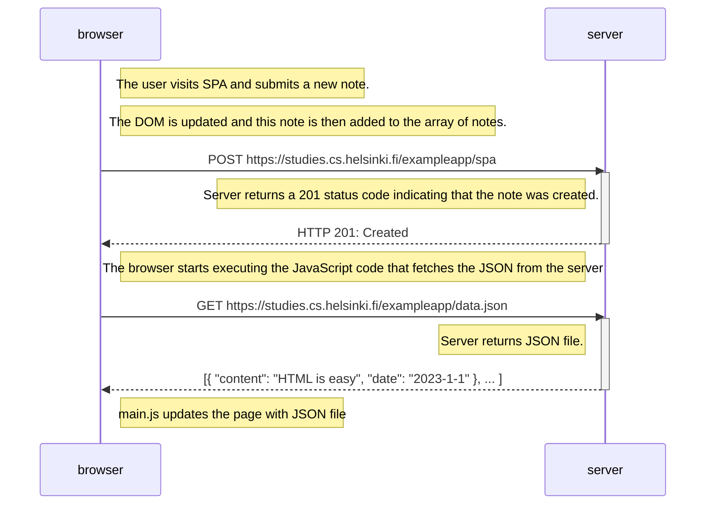

```mermaid
  sequenceDiagram
    participant browser
    participant server
    
    Note right of browser: The user visits SPA and submits a new note.
    Note right of browser: The DOM is updated and this note is then added to the array of notes.
   
    browser->>server: POST https://studies.cs.helsinki.fi/exampleapp/spa
    activate server

    Note left of server: Server returns a 201 status code indicating that the note was created.

    server-->>browser: HTTP 201: Created
    deactivate server

    Note right of browser: The browser starts executing the JavaScript code that fetches the JSON from the server

    browser->>server: GET https://studies.cs.helsinki.fi/exampleapp/data.json
    activate server

    Note left of server: Server returns JSON file.

    server-->>browser: [{ "content": "HTML is easy", "date": "2023-1-1" }, ... ]
    deactivate server

    Note right of browser: main.js updates the page with JSON file
```