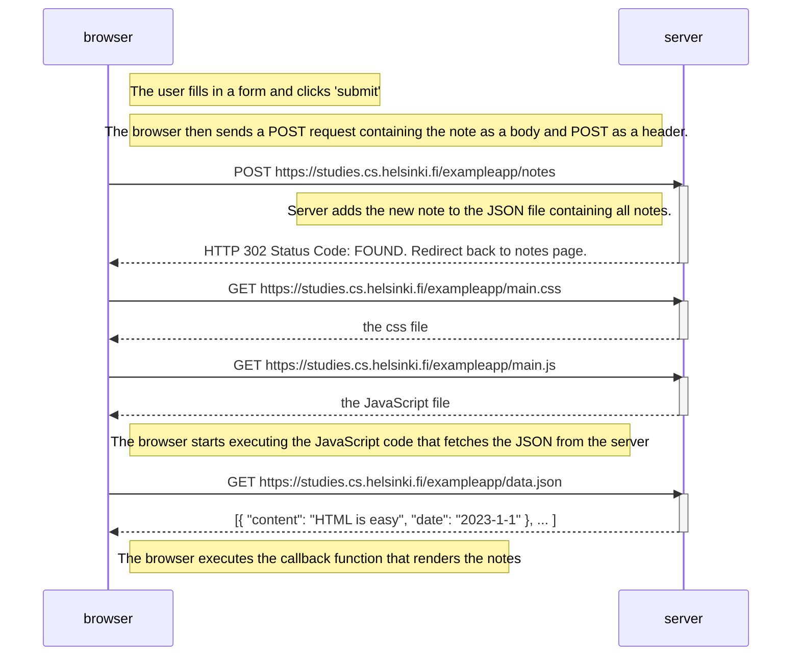

```mermaid
  sequenceDiagram
    participant browser
    participant server
    
    Note right of browser: The user fills in a form and clicks 'submit'
    Note right of browser: The browser then sends a POST request containing the note as a body and POST as a header.

    browser->>server: POST https://studies.cs.helsinki.fi/exampleapp/notes
    activate server

    Note left of server: Server adds the new note to the JSON file containing all notes.

    server-->>browser: HTTP 302 Status Code: FOUND. Redirect back to notes page.
    deactivate server

    browser->>server: GET https://studies.cs.helsinki.fi/exampleapp/main.css
    activate server
    server-->>browser: the css file
    deactivate server

    browser->>server: GET https://studies.cs.helsinki.fi/exampleapp/main.js
    activate server
    server-->>browser: the JavaScript file
    deactivate server

    Note right of browser: The browser starts executing the JavaScript code that fetches the JSON from the server

    browser->>server: GET https://studies.cs.helsinki.fi/exampleapp/data.json
    activate server
    server-->>browser: [{ "content": "HTML is easy", "date": "2023-1-1" }, ... ]
    deactivate server

    Note right of browser: The browser executes the callback function that renders the notes
```